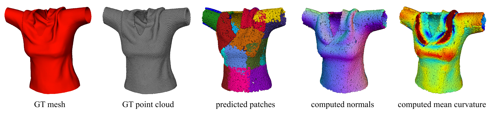

# Shape Reconstruction by Learning Differentiable Surface Representations

This repository contains the official source code of the paper [**Shape 
Reconstruction by Learning Differentiable Surface Representations**](https://arxiv.org/abs/1911.11227) 
published in CVPR 2020.



 # Install
 
 In order to run the code you will need a GPU with CUDA support and Python 
 interpreter. The required Python packages are listed below.  
 
 ## Requirements

The code was tested with Python 3.6 and Python packages which you can find in 
`requirements.txt` file. 

## Environment

The easiest way to experiment with the code is to 
create a new Python environment e.g. using 
[virtualenvwrapper](https://virtualenvwrapper.readthedocs.io/en/latest/) 
and install the required packages.

```
mkvirtualenv --python=python3.6 diffsurfrep
pip install -r requirements.txt
```

Get the code and prepare the environment as follows:

```
git clone git@github.com:bednarikjan/differential_surface_representation.git
export PYTHONPATH="{PYTHONPATH}:path/to/dir/differential_surface_representation"
```


 
 # Data
 
 The publicly available datasets which the work relies on, ShapeNet and 
 Textureless Deformable Surfaces can be obtained as follows.
 
 ## ShapeNet
 The same custom ShapeNet dataset as in 
 [AtlasNet](https://github.com/ThibaultGROUEIX/AtlasNet) 
 is used. For download instructions please refer to the 
 [convenience scripts](https://github.com/ThibaultGROUEIX/AtlasNet/tree/master/dataset)
 released with AtlasNet.
 
 ### Precomputing GT surface areas
 One of the loss functions relies on access to GT surface area of the objects. 
 This quantity is not readily available within the dataset. Please use the 
 script [`preprocessing/shapenet_mesh_area.py`]() to precompute the areas for 
 all the data samples (the script adds this information to the dataset files 
 directly).
 
 ## Textureles Deformable Surfaces
 The technical details about the dataset and download instructions are 
 available [here](https://www.epfl.ch/labs/cvlab/data/texless-defsurf-data/).
 
 
 # Run
 
 The script `train.py` reproduces the point cloud auto-encoding (PCAE) 
 experiments on individual or multiple ShapeNet object categories. More 
 specifically, it builds the model and trains it from scratch while logging
 the training information and saving the current netowrk weights to the output
 directory specified using `--output` argument (see below). 
 
 The training parameters can be set using the `config.yaml` configuration file. 
 The default preset values correspond to the ones used in the paper. Before 
 running the training, you have to set the paths to the dataset on your local
 machine using `config.yaml`.
 
 ```
python train.py --conf config.yaml --output path/to/output/dir
```

To monitor the training, start Tensorboard as follows and then navigate to 
`http://localhost:8008/` in your browser.

```
cd path/to/output/dir
tensorboard --logdir=. --port=8008 --bind_all
```
 
 # Results
 
 Qualitative results for point cloud auto-encoding (PCAE) task on ShapeNet.
 
 
 
 Qualitative results for single-view reconstruction (SVR) task on Textureless 
 Deformable Surfaces.

 
 
 # Citation
 
 ```
@inproceedings{bednarik2020,
    title={Shape Reconstruction by Learning Differentiable Surface Representations},
    author={Bednarik, Jan and Parashar, Shaifali and Gundogdu, Erhan and Salzmann, Mathieu andFua, Pascal},
    booktitle={Proceedings IEEE Conf. on Computer Vision and Pattern Recognition (CVPR)},
    year={2020}
}
```
 
